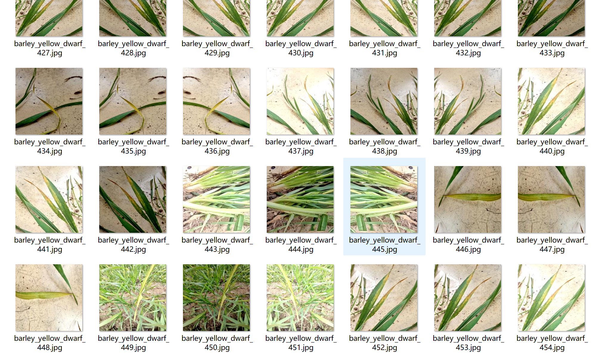
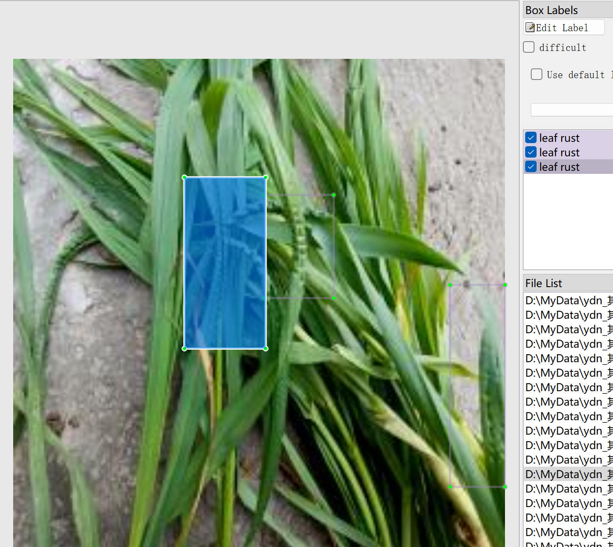
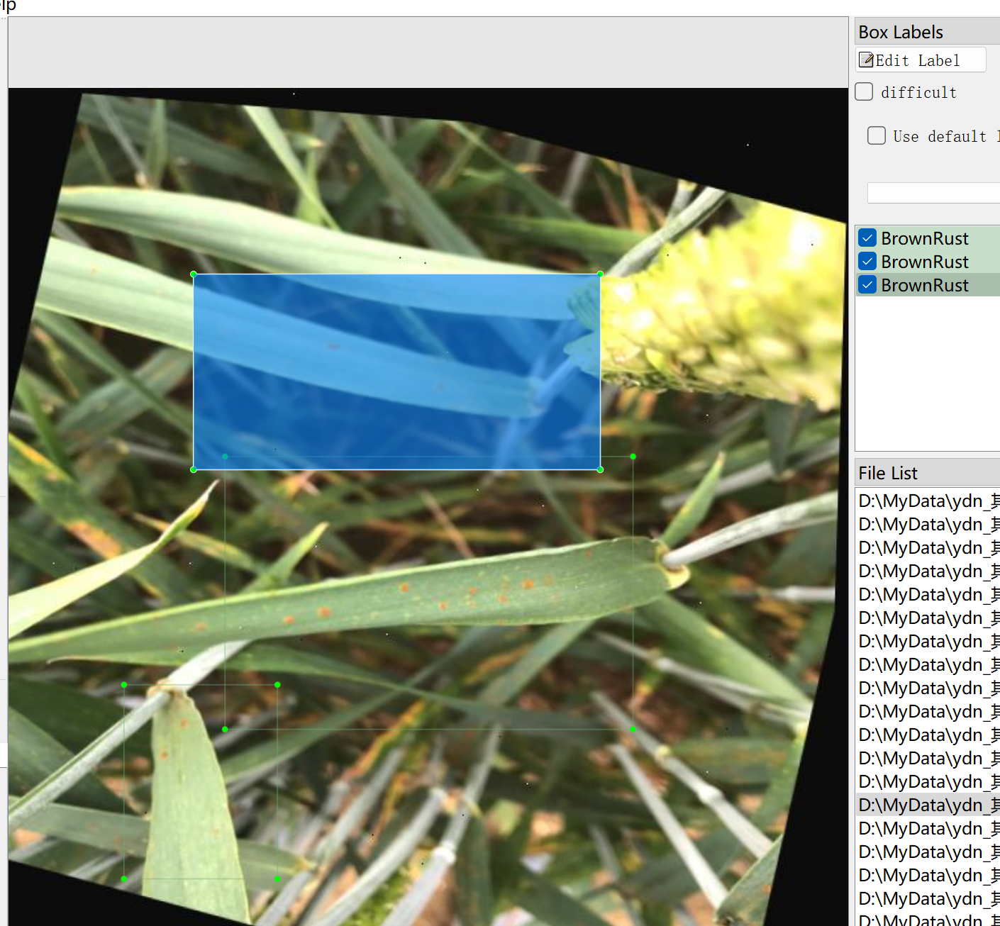
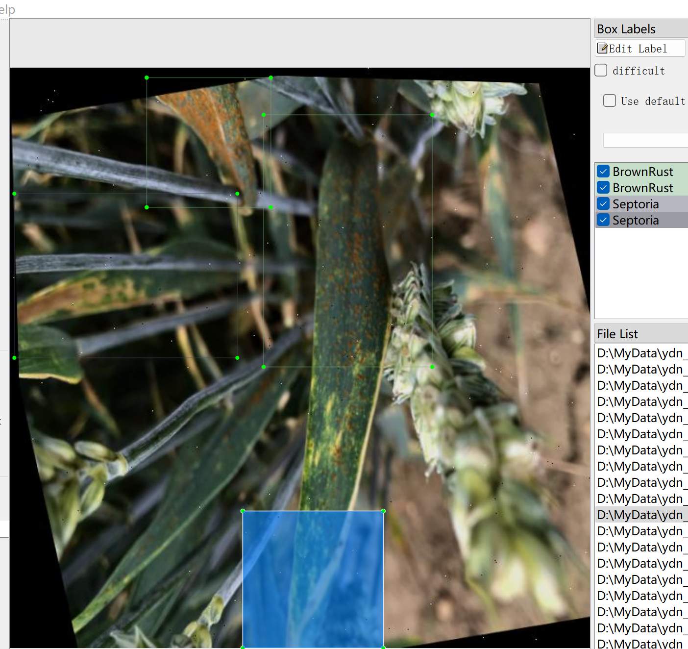
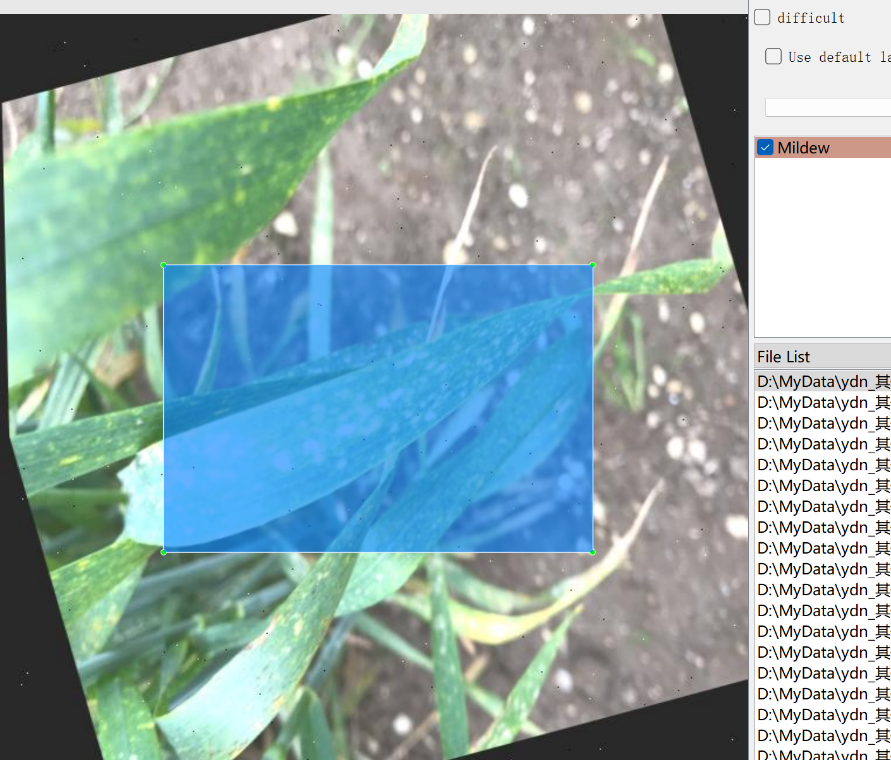
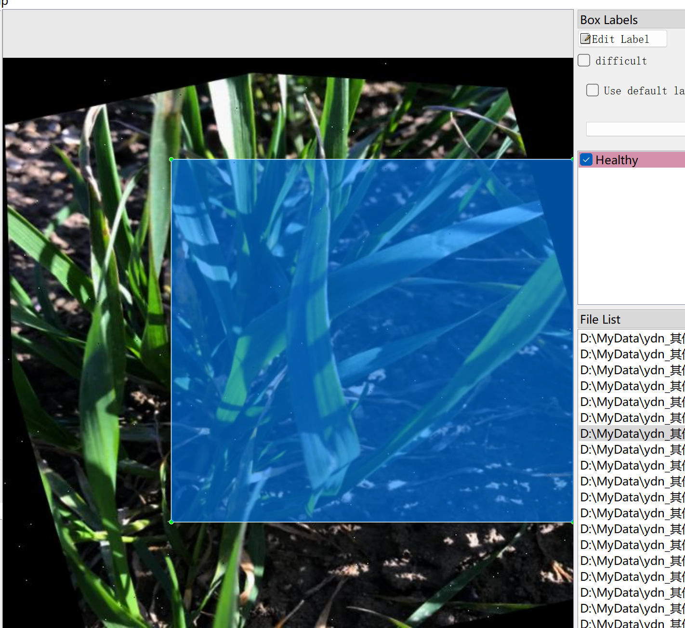
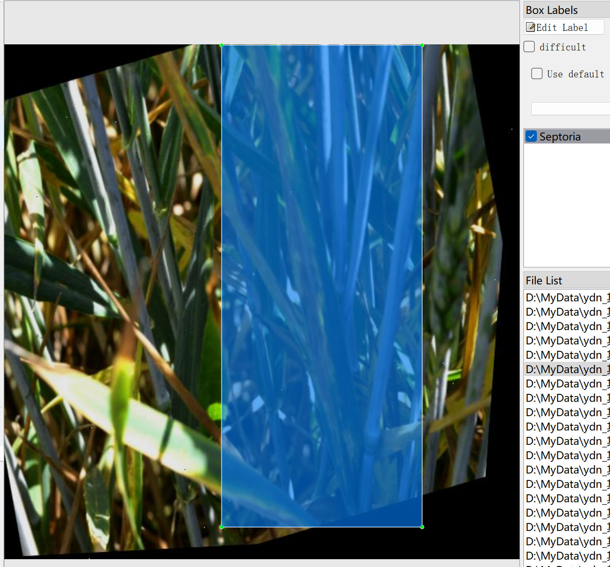

# 9 Types of Wheat Diseases - Target Detection Dataset

Dataset Information Introduction: A total of 10,825 images are available along with their corresponding ground-truth files. The ground-truth files are provided in two formats, including the VOC formatted XML files and the YOLO formatted txt files. The targets for detection include the following:
- Brown rust
- Healthy
- Loose-smut
- Mildew
- Septoria
- Yellow rust
- barley yellow dwarf
- leaf rust
- powdery mildew

Each column contains information about the number of images and the number of bounding box annotations: (Annotations are usually labeled in English, with the Chinese names provided within brackets for reference)
Note: An image may contain multiple targets, thus the total number of bounding boxes might exceed the number of images.
The complete dataset consists of three folders and one txt file:
- all_txt folder and classes.txt: Stores the YOLO formatted txt ground-truth files, in the same quantity as the images, with each ground-truth file corresponding to an image.
- classes.txt:
- all_xml file: The VOC formatted XML ground-truth files.
- The quantity and images match, with each ground-truth file corresponding to an image.
How to view the standard VOC format documentation can be found by your own research on Baidu.
Both formats of the ground-truth are usable; choose either one based on preference.
Ground-truth effect screenshots:

## Images

Here is a pay link on Stripe ( https://buy.stripe.com/3cs8yP7sY87d0vu9AB ). Please contact me lonlonago@foxmail.com after funding $89, and I will send you a complete data files , thank you!

